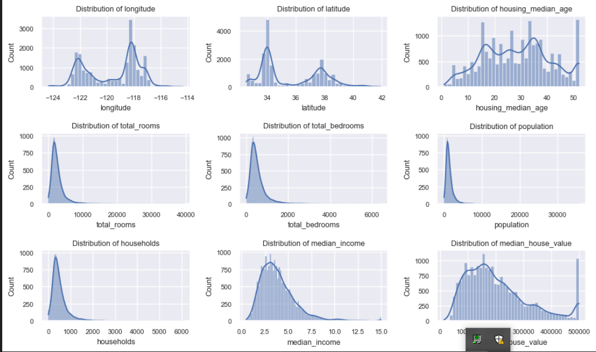
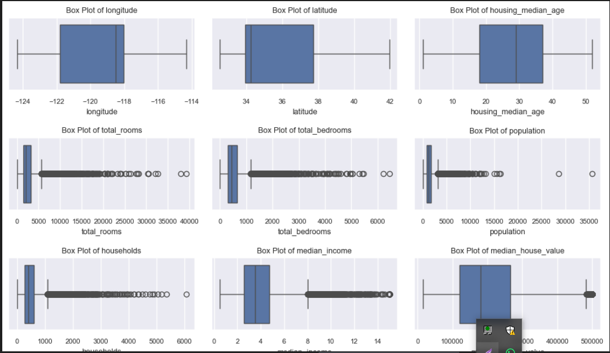
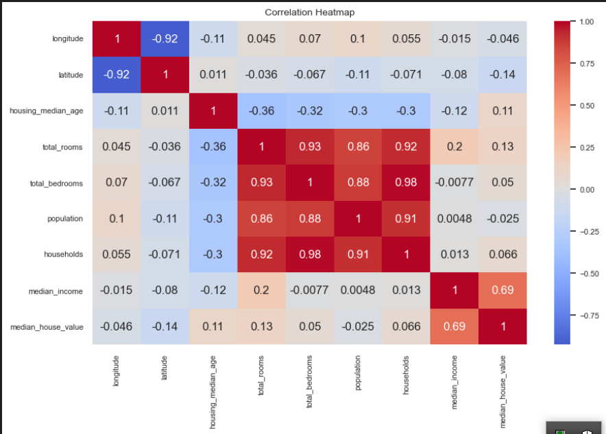
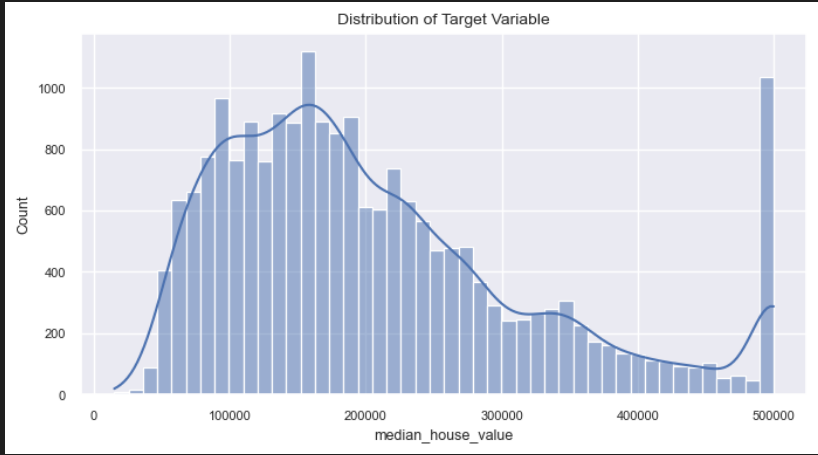
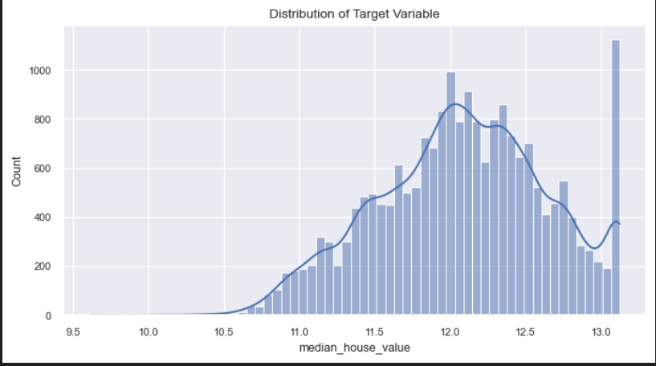
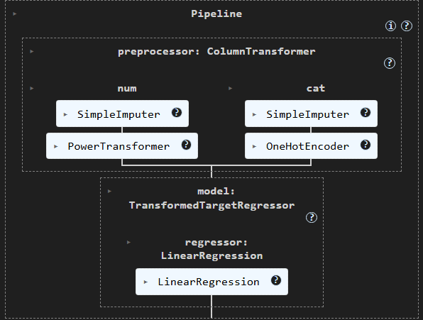
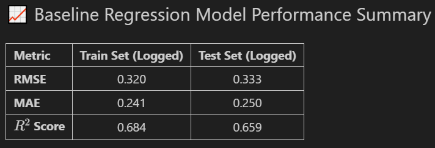
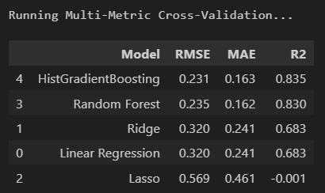
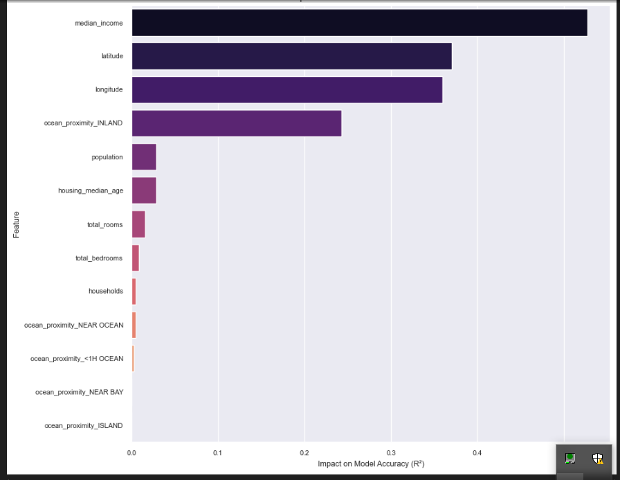

# California Housing Price Prediction

## 📌 Project Overview & Key Findings
This project analyzes the California Housing Dataset to predict median house values using advanced regression techniques. By implementing a robust Scikit-Learn pipeline and comparing multiple models, I achieved a high-accuracy predictive framework.

📊 Exploratory Data Analysis (EDA)

 
  
   
  <em>Figure 1: Distribution of all numerical features in the dataset.</em>

 
  
   
  <em>Figure 2: Distribution of all numerical features in the dataset.</em>

 
  
   
  <em>Figure 3: Correlation matrix showing relationships between features and the target variable.</em>

⚙️ Data Preprocessing & Pipeline

 
  
  
   
  <em>Figure 4: Target variable distribution before (skewed) and after (normalized) log transformation.</em>

 
  
   
  <em>Figure 5: Automated preprocessing pipeline using ColumnTransformer and PowerTransformer.</em>

 
  
   
  <em>Figure 6: Automated preprocessing pipeline using ColumnTransformer and PowerTransformer.</em>

🏆 Model Performance & Evaluation

 
  
   
  <em>Figure 7: Comparison of RMSE, MAE, and R² scores across multiple regression models.</em>

 
  
   
  <em>Figure 8: Impact of specific features on model accuracy.</em>

---

## 🛠️ The Machine Learning Pipeline
I implemented a robust pipeline to handle scaling and model training. The following algorithms were tested:

* **Linear Regression**: Baseline performance.
* **Ridge & Lasso**: Regularization analysis.
* **Random Forest**: Ensemble patterns.
* **HistGradientBoosting**: Histogram-based boosting.

---

## 🏆 Key Results
After evaluating the models using Mean Squared Error (RMSE) and $R^2$ scores:

**The Winner:** `HistGradientBoostingRegressor`

This model outperformed the others by efficiently handling the feature set and providing the lowest error rates.

---

## 🚀 How to Run
1. **Clone the repo:** `git clone https://github.com/your-username/repo-name.git`
2. **Install dependencies:** `pip install -r requirements.txt`
3. **Execute the Notebook:** Run `California_Housing_Analysis.ipynb`.
1. **Clone the repo:** `git clone https://github.com/your-username/repo-name.git`
2. **Install dependencies:** `pip install -r requirements.txt`
3. **Execute the Notebook:** Run `California_Housing_Analysis.ipynb`.
